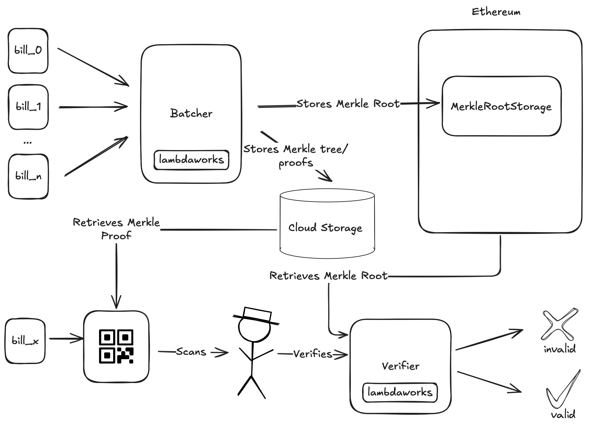

# EsyaSoft Electricity Bills Batcher

Demo project for **EsyaSoft** to batch electricity bills, generate Merkle proofs, and verify them using Merkle trees. This project leverages the [**Lambdaworks**](https://github.com/lambdaclass/lambdaworks) library for Merkle tree functionality and **Ethereum** smart contracts for on-chain Merkle root storage.

## Getting Started

This project requires **Foundry** and **Cargo** to be installed. Follow these steps to get the project up and running.

### Prerequisites

- **Rust and Cargo**: Install from [rust-lang.org](https://www.rust-lang.org/).
- **Foundry**: Install Foundry by running:

  ```sh
  curl -L https://foundry.paradigm.xyz | bash
  foundryup
  ```

- **Git**: Ensure Git is installed.

### Initialization

Start by setting up the project directory and building the necessary components. Run the following command:

```sh
make init
```

This command performs the following:
- Creates an `output` directory for generated proofs.
- Initializes and updates Git submodules.
- Builds the **batcher** Rust application.
- Builds the **contracts** using Foundry.
- Starts a local Ethereum node using **Anvil**.

## System Diagram

The following diagram illustrates the overall architecture of the project:



### Run the demo

1. **Deploy Contracts**: Deploys the `MerkleRootStorage` smart contract to the local Anvil network.

   ```sh
   make deploy_contracts
   ```

   This command deploys the contract by running a `forge script` command, which executes the `MerkleRootStorageScript` script located in the `contracts` folder.

2. **Generate Proofs**: Generates Merkle proofs for each bill in the specified `bills_path`.

   ```sh
   make generate_proofs
   ```

   This command uses the `generate-proof` subcommand, reading the list of bills from `../data/electricity_bills.json` and generating proofs for each. The `certificate_key` is required to associate the Merkle root with a unique identifier in the contract.

3. **Verify a Bill**: Verifies a specific bill’s proof against the on-chain Merkle root.

   ```sh
   make verify_bill
   ```

   This command verifies a specific bill's proof stored in `../output/merkle_proof_2.json`. It compares the Merkle root on-chain with the locally computed root for the bill specified by `index`.

4. **Verify a Corrupted Bill**: Verifies a corrupted bill's proof, demonstrating how an invalid bill fails verification.

   ```sh
   make verify_bill_corrupted
   ```

   This command runs the verify-proof subcommand using a corrupted bill file, located at ../data/electricity_bill_2_corrupted.json, with proof data stored in ../output/merkle_proof_2.json. This example showcases failure handling by verifying a proof with mismatched data.

---

### Summary

This project demonstrates how to batch and verify data using Merkle trees in Rust and Ethereum smart contracts, making it easy to verify large datasets efficiently on-chain. This setup can be easily adapted to other data batching and proof generation use cases.
